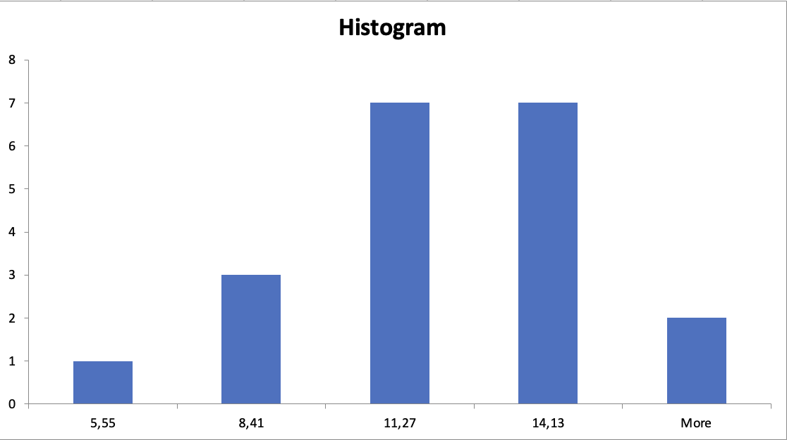
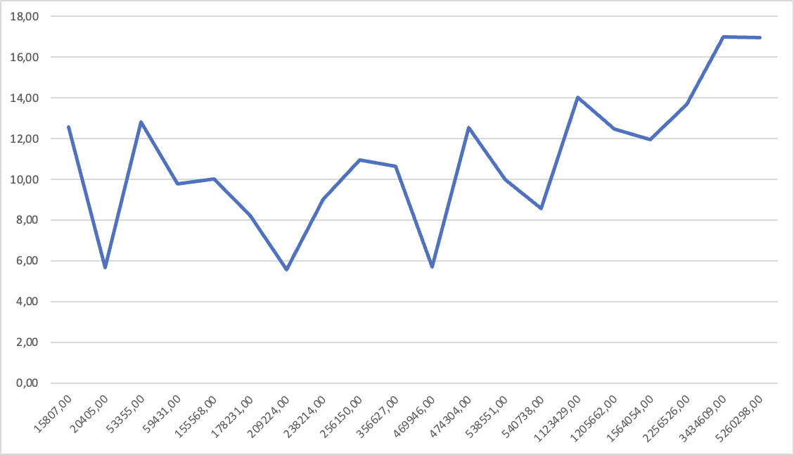
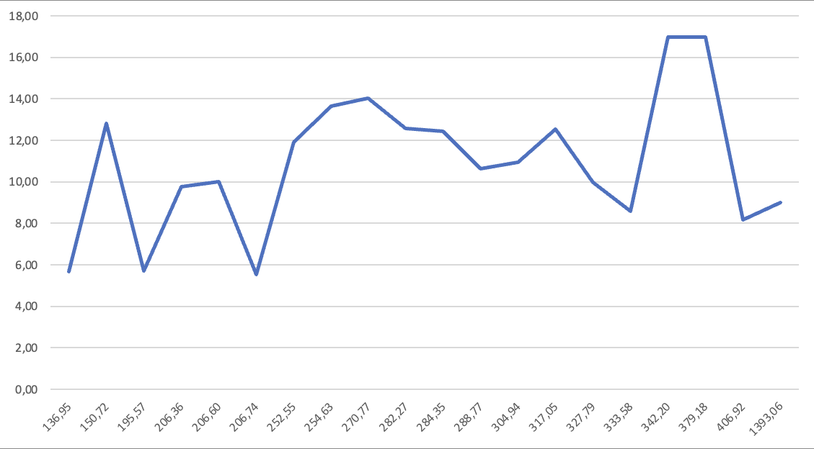

# Code Quality Research

This little project is a small research on code quality.
I'm trying to gather some data on code quality of some hand-picked open source projects.

> If you are looking for my conclusion - it's [right here](#conclusion).

## Motivation

There is an ongoing debate in the software development community about one specific code quality issue:
should we use comments in our code or not?
While some people say that comments are a mispractice and should be avoided by writing self-explanatory code,
others prefer to comment their code nevertheless.

Before taking any sides in this debate, I wanted to gather some data on the topic.
Especially I wondered how many comments are there in the codebases of popular and well-established open source projects.
I suppose this might be a good indication on the topic.
Since these projects are well-known and well-established
and they exist and are begin developed, improved and maintainted for a signficant time,
their development processes and practices are at very least good enough to be considered as a reference.

## Methodics

I've decided to use a simple metric to measure the code quality:
_a relative amount of comments in the code (relative to overall amount of code)_.

In order to calculate this metric, I've written a small tool that scans the codebase of a project,
runs the `gocloc` tool on it and then calculates the metric.

For example, let's assume that `gocloc` provided the following output:

```json
{
	"languages" : [
		{
			"name"    : "Go",
			"files"   : 149,
			"code"    : 16641,
			"comment" : 2912,
			"blank"   : 3194
		}
	],
	"total" : {
		"files"   : 149,
		"code"    : 16641,
		"comment" : 2912,
		"blank"   : 3194
	}
}
```

For that output, the `comments per code` metric would be calculated as follows:

```text
CommentPerCode = 100% * json.languages[0].comment / json.languages[0].code
			   = 100% * 2912 / 16641
			   = 17.50%
```

For this metric I've calculated the average, min, max, P50, P75, P90, P95 and P99 percentiles
to be able to study values' distribution.

I should admit: this is not a perfect metric.
It doesn't separate `godoc`-style comments from regular comments,
which might be important for more detailed study.
However, I've decided to keep it simple for now:
running `go doc` might fail to a specific codebase,
therefore some of the selected projects might fail to compute more precise metric.

However, the tool I've written removes license headers from soource files while keeping package-level `godoc`-style comments.
This should improve the accuracy of the metric since a lot of OSS projects include (almost) the same license header
as a comment into every source file.

Still, I see this as a point of possible improvement for the future.

## Raw data

| Project                                                  |   Files | Total lines of code | Average LOC per file | Comments per code |
| :------------------------------------------------------- | ------: | ------------------: | -------------------: | ----------------: |
| [`compose`](https://github.com/docker/compose)           |   `149` |             `20405` |             `136.95` |           `5.68%` |
| [`nats-server`](https://github.com/nats-io/nats-server)  |   `171` |            `238214` |            `1393.06` |           `9.00%` |
| [`containerd`](https://github.com/containerd/containerd) |  `4240` |           `1205662` |             `284.35` |          `12.45%` |
| [`buildkit`](https://github.com/moby/buildkit)           |  `4149` |           `1123429` |             `270.77` |          `14.02%` |
| [`rclone`](https://github.com/rclone/rclone)             |   `840` |            `256150` |             `304.94` |          `10.93%` |
| [`gogs`](https://github.com/gogs/gogs)                   |   `288` |             `59431` |             `206.36` |           `9.78%` |
| [`kubernetes`](https://github.com/kubernetes/kubernetes) | `15372` |           `5260298` |             `342.20` |          `16.96%` |
| [`helm`](https://github.com/helm/helm)                   |   `354` |             `53355` |             `150.72` |          `12.81%` |
| [`go`](https://github.com/golang/go)                     |  `8862` |           `2256526` |             `254.63` |          `13.66%` |
| [`grafana`](https://github.com/grafana/grafana)          |  `2403` |            `469946` |             `195.57` |           `5.71%` |
| [`loki`](https://github.com/grafana/loki)                |  `9058` |           `3434609` |             `379.18` |          `16.99%` |
| [`prometheus`](https://github.com/prometheus/prometheus) |   `438` |            `178231` |             `406.92` |           `8.17%` |
| [`moby`](https://github.com/moby/moby)                   |  `6193` |           `1564054` |             `252.55` |          `11.93%` |
| [`bbolt`](https://github.com/etcd-io/bbolt)              |    `56` |             `15807` |             `282.27` |          `12.56%` |
| [`etcd`](https://github.com/etcd-io/etcd)                |  `1012` |            `209224` |             `206.74` |           `5.55%` |
| [`terraform`](https://github.com/hashicorp/terraform)    |  `1235` |            `356627` |             `288.77` |          `10.62%` |
| [`hugo`](https://github.com/gohugoio/hugo)               |   `753` |            `155568` |             `206.60` |          `10.01%` |
| [`consul`](https://github.com/hashicorp/consul)          |  `1621` |            `540738` |             `333.58` |           `8.58%` |
| [`vault`](https://github.com/hashicorp/vault)            |  `1496` |            `474304` |             `317.05` |          `12.55%` |
| [`nomad`](https://github.com/hashicorp/nomad)            |  `1643` |            `538551` |             `327.79` |           `9.99%` |

`60 333` files were analyzed, they contained `18 411 129` lines of code.

## Analysis

Running the analysis, I've got the following results:

| Parameter |    Value |
| :-------- | -------: |
| Min       |  `5.55%` |
| Max       | `16.99%` |
| Average   | `10.00%` |
| P99:      | `16.96%` |
| P95:      | `14.02%` |
| P90:      | `13.66%` |
| P75:      | `12.55%` |
| P50:      | `10.01%` |



First of all, I should note that the results are not very precise for a few reasons:

- I've used a very simple metric, which doesn't separate code comments from package comments.
  It's debatable whether it should separate them or not.

- I've selected only a few projects, which might not be representative enough.
  However, I've tried to select projects of different sizes and domains, developed by different vendors.

Keeping that in mind, I can say that the results are quite interesting.

### Most commented projects

First of all, most of the projects have a lot of comments.
It's enough to say that half of them have slightly more than 8% of comments.

Only there of these projects have less than 8% of comments, and they are:

- [`etcd`](https://github.com/etcd-io/etcd)
- [`compose`](https://github.com/docker/compose)
- [`grafana`](https://github.com/grafana/grafana)

### Least commented projects

Secondly, only two projects have more than 15% of comments:

- [`kubernetes`](https://github.com/kubernetes/kubernetes)
- [`loki`](https://github.com/grafana/loki)

It's worth mentioning that [Golang sources](https://github.com/golang/go) are very close to that value (13.66%).
However, it's a very specific project - it's more of a platform than a single application.
This is why I think it's wise to exlude it from the top.
However I don't feel I should exclude it from the overall research
since Golang sources are an obviously good reference point if you are looking for an example of idiomatic Go code.

### Correlation between comment rate and codebase size



It should be noted that 5 projects with the largest codebases all have more than 10% of comments:

- [`containerd`](https://github.com/containerd/containerd)
- [`moby`](https://github.com/moby/moby)
- [`go`](https://github.com/golang/go)
- `loki`](https://github.com/grafana/loki)
- [`kubernetes`](https://github.com/kubernetes/kubernetes)

### Correlation between comment rate and file size



There seems to be no visible correlation between comment rate and file size.

## Conclusion

Before saying anything, I should put an extra emphasis on this statement:
**even best comments would not make an excluse for a bad code**.
Most certainly I am not trying to encourage anyone to write bad code that is barely readable
and them make it readable with lots of comments.

Still, if you are willing to keep your code comments up
with what seems to be publicly accepted level of quality,
I could recommend you to follow these rules:

- Your code should have at least `5%` of comments.
  Having less than that is a sign that some compicated parts of your code are not documented well enough.

- Your code should not have more than `20%` of comments.
  Having more that that is a sign that your code is overdocumented
  and it's likely that some of the comments are redundant.

- While first two rules might be a viable guidelines, they are not dogmas.
  You should make a justified desicion on each case individually.

It might be absolutely necessary to have even 50% of comments for some projects,
while some other ones might need less than 1% of comments.
However, I believe it would be a great idea to compare your project
with some well-known open source ones
to have a point of reference.
Your decisions must be justified, and not only by your own wismod - but on a wisdom gathered by the whole humanity.

## Research details and process

Any research should be reproducible, otherwise it has no real value.
This is why I've described the process of collecting and analyzing data below.

### Prerequisites

Before you can run the project, you need to install the following tools:

- `bash` and some other GNU tools (`bc`, `awk`, `sort`, `make` - you probably already have them)
- `git`
- [`gocloc`](https://github.com/hhatto/gocloc) (I've used it instead of `cloc` because it's way faster)

### Source projects

See `sources.d/*` files for the list of projects.
Only Golang projects are supported at the moment.

The following projects were selected to be studyied:

- [github.com/docker/compose.git](https://github.com/docker/compose.git)
- [github.com/nats-io/nats-server.git](https://github.com/nats-io/nats-server.git)
- [github.com/containerd/containerd.git](https://github.com/containerd/containerd.git)
- [github.com/moby/buildkit.git](https://github.com/moby/buildkit.git)
- [github.com/rclone/rclone.git](https://github.com/rclone/rclone.git)
- [github.com/gogs/gogs.git](https://github.com/gogs/gogs.git)
- [github.com/kubernetes/kubernetes.git](https://github.com/kubernetes/kubernetes.git)
- [github.com/helm/helm.git](https://github.com/helm/helm.git)
- [github.com/golang/go.git](https://github.com/golang/go.git)
- [github.com/grafana/grafana.git](https://github.com/grafana/grafana.git)
- [github.com/grafana/loki.git](https://github.com/grafana/loki.git)
- [github.com/prometheus/prometheus.git](https://github.com/prometheus/prometheus.git)
- [github.com/moby/moby.git](https://github.com/moby/moby.git)
- [github.com/etcd-io/bbolt.git](https://github.com/etcd-io/bbolt.git)
- [github.com/etcd-io/etcd.git](https://github.com/etcd-io/etcd.git)
- [github.com/hashicorp/terraform.git](https://github.com/hashicorp/terraform.git)
- [github.com/gohugoio/hugo.git](https://github.com/gohugoio/hugo.git)
- [github.com/hashicorp/consul.git](https://github.com/hashicorp/consul.git)
- [github.com/hashicorp/vault.git](https://github.com/hashicorp/vault.git)
- [github.com/hashicorp/nomad.git](https://github.com/hashicorp/nomad.git)

Projects were selects on a simple criteria:
it must be a (relatively) populated project with a good amount of code.

### Usage

Run the following command to start the analysis:

```bash
make
```

This command would fetch the source projects, run the analysis and generate the report.
The report will be stored in the `output` directory:

- `output/report.md` - the report itself
- `output/table.md` - per-project table

Parts of there files can be copy-pasted into this document.

## License

[MIT](LICENSE)
